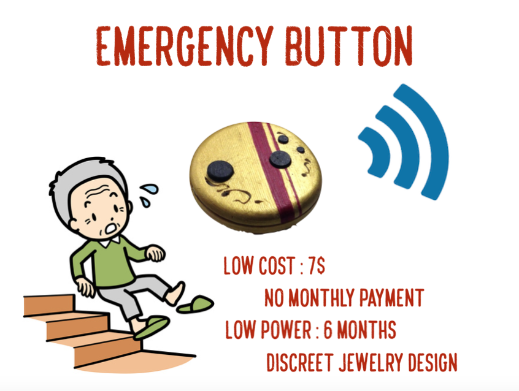

# Emergency_button-Reliable-Inexpensive-Design

One of the main problems for old age people is keeping their balance while walking. It is getting more and more difficult to move, and if they fall down it's very complicated to get back up. My family is calling my grandmother every evening to check for this kind of problem. There are some emergency buttons that can help, but you often have an expensive monthly payment for the call center. In addition, most old people don't like to wear some gray plastic technologies around their neck.   

So my question is :   

How to make a device cheap, reliable, easy to integrate, discret and with no monthly payment?

The Wifi ESP8266 version of the project is described here : https://hackaday.io/project/27017-emergency-button-reliable-inexpensive-design

The Z-Wave Z-Uno version of the project is described here : 

https://www.hackster.io/jeanperardel/emergency-button-with-z-wave-3g-nova-gateway-df0c78
https://makershare.com/projects/emergency-button-z-wave-3g-gateway

